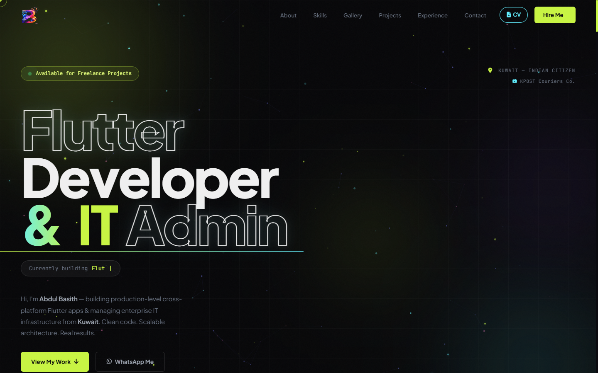
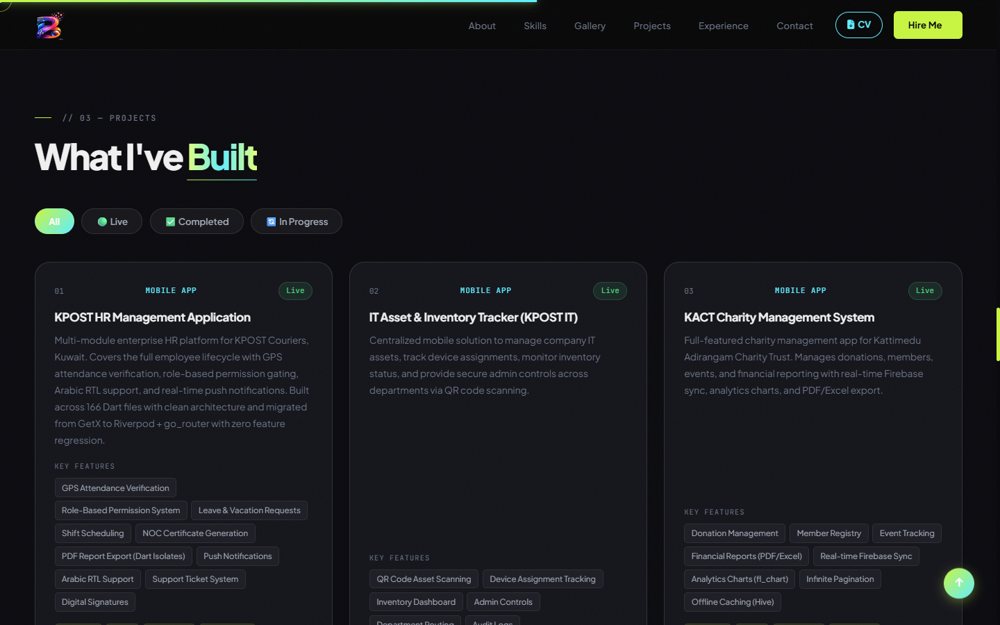
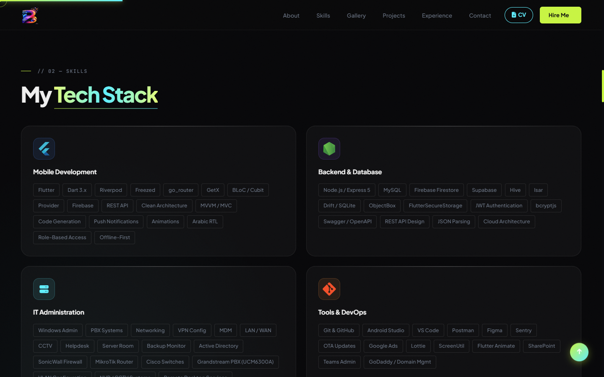
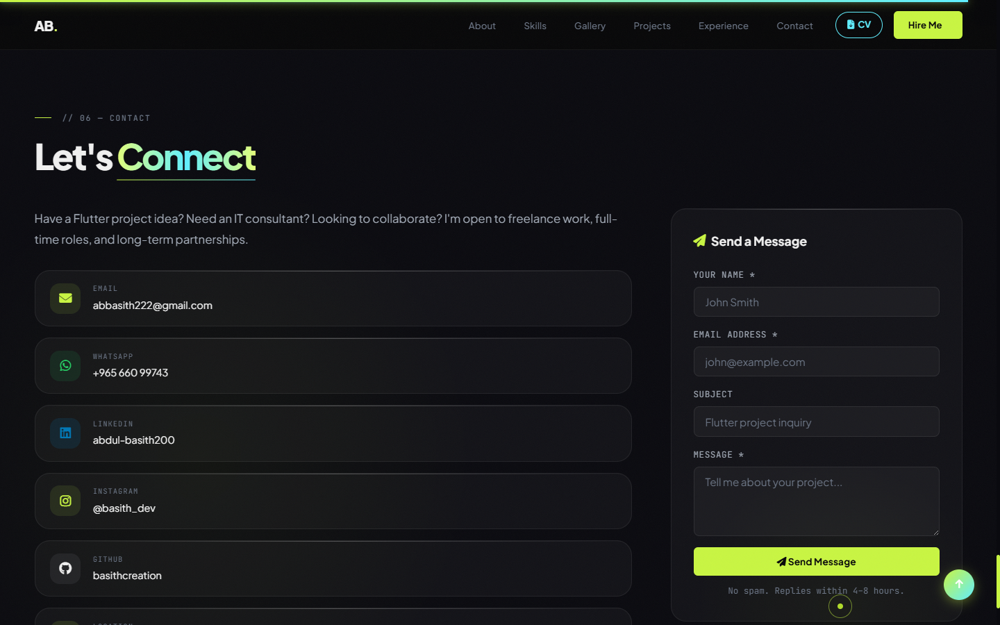
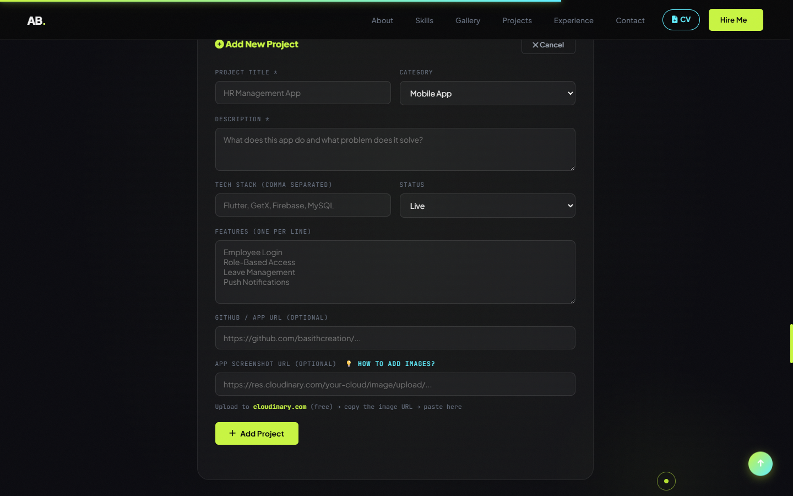
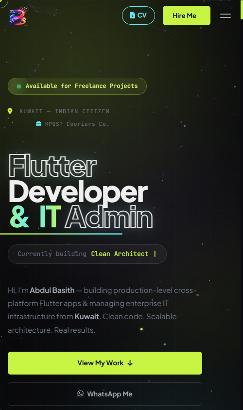

<div align="center">

<!-- Animated typing header -->


<br/>

<!-- Tech stack badges -->


<br/>

<!-- Status badges -->


-c8f542?style=flat-square&labelColor=060608>)


</div>

---

## ✨ Live Features

<table>
<tr>
<td>

**UI / Animation**

- Animated gradient mesh background
- Custom cursor with glow trail
- AOS scroll-reveal on every section
- Loader with live percentage counter
- Marquee skill ticker strip
- Glassmorphism cards & modals

</td>
<td>

**Sections**

- Hero with outlined + gradient title
- About, Skills (16+ Devicons)
- Projects — filterable card grid
- Experience — vertical timeline
- Contact + WhatsApp CTA

</td>
<td>

**Admin / Data**

- Zero backend, zero API keys
- Projects in a static JS data file
- Local-only admin panel (hidden on the live site)
- Publish changes with a simple `git push`

</td>
</tr>
</table>

---

## 📸 Application Screenshots

<div align="center">

|         Hero Section          |             Projects Grid             |
| :---------------------------: | :-----------------------------------: |
|  |  |

|          Skills Section           |           Contact Section           |
| :-------------------------------: | :---------------------------------: |
|  |  |

|      Admin Panel (local only)      |            Mobile View            |
| :--------------------------------: | :-------------------------------: |
|     |  |

</div>

---

## 📁 Project Structure

```
basith-portfolio/
│
├── 📄 index.html          ← All sections (single-page)
├── 📁 css/
│   └── main.css           ← Variables · Layout · Animations · Responsive
├── 📁 js/
│   ├── projects-data.js   ← Projects data (static — this IS the database)
│   ├── db.js              ← Data layer (read file · download updated copy)
│   └── app.js             ← Loader · Cursor · AOS · Counter · Admin panel
├── 📁 logo/               ← SVG brand assets
├── 📁 screenshots/        ← README screenshots
├── 🖼 og-image.png         ← Social sharing card (1200×630)
└── 📄 README.md
```

---

## 🚀 Deploy to GitHub Pages (Free)

```bash
# 1. Push this repo to GitHub (public)
# 2. Go to: Settings → Pages → Source: Deploy from branch (main / root)
# The site is live at:
https://basithcreation.github.io/basith-portfolio/
```

---

## 🗄️ Projects Data — No Database, No API Keys

Projects live in **[js/projects-data.js](js/projects-data.js)** — a plain JavaScript file committed to the repo. The published site contains **zero credentials**: nothing to steal, nothing to hack.

**To add or edit projects:**

1. Open the site **locally** (`python -m http.server` or double-click `index.html`)
2. Scroll to Projects → click **"Manage Projects"** → enter password
3. Add / edit / delete in the form — an updated `projects-data.js` **downloads automatically**
4. Replace `js/projects-data.js` with the downloaded file
5. Publish:
   ```bash
   git add js/projects-data.js
   git commit -m "Update projects"
   git push       # GitHub Pages redeploys automatically
   ```

> Prefer editing by hand? Just edit the array in `js/projects-data.js` directly — same fields, same result.

---

## 🔐 Admin Panel (local only)

The **"Manage Projects"** button is hidden on the live site — it only appears when the site runs on `localhost` / `127.0.0.1` / `file://`. It's a publishing aid, not a live CMS.

| Action               | Steps                                                     |
| :------------------- | :-------------------------------------------------------- |
| **Open admin**       | Run locally → Projects section → **"Manage Projects"**    |
| **Default password** | `basith@2025` — change `ADMIN_PW` in [js/db.js](js/db.js) |
| **Add project**      | Fill the form → click **Add Project**                     |
| **Edit project**     | Click **Edit** on any project card                        |
| **Delete project**   | Click **Delete** on any project card                      |
| **Publish**          | Replace `js/projects-data.js` with the download → push    |

---

## ✏️ Customization Cheatsheet

| What to change     | File                                                    | Find / Replace                     |
| :----------------- | :------------------------------------------------------ | :--------------------------------- |
| Name, email, phone | [index.html](index.html)                                | Search & replace text              |
| WhatsApp number    | [index.html](index.html)                                | `96566099743`                      |
| Instagram handle   | [index.html](index.html)                                | `basith_dev`                       |
| Projects           | [js/projects-data.js](js/projects-data.js)              | Edit the `PROJECTS_DATA` array     |
| Accent colors      | [css/main.css](css/main.css)                            | `:root` → `--a1`, `--a2`           |
| Display font       | [index.html](index.html) + [css/main.css](css/main.css) | Google Fonts link + `--ff-display` |
| Admin password     | [js/db.js](js/db.js)                                    | `const ADMIN_PW`                   |

---

## 🎨 Design Tokens

```css
/* css/main.css — :root */
--bg: #060608; /* page background   */
--a1: #c8f542; /* lime accent       */
--a2: #60efff; /* cyan accent       */
--glass: rgba(255, 255, 255, 0.04); /* card background */
```

---

## 🤖 Regenerate with Claude Code

<details>
<summary><b>Click to copy the full Claude prompt</b></summary>

```
I need a production-grade personal portfolio website for Abdul Basith,
a Flutter Developer & IT Administrator based in Kuwait.

DESIGN REQUIREMENTS:
- 2025 modern style: massive outlined hero text, glassmorphism cards,
  animated gradient mesh background (lime + cyan orbs), floating tech badges,
  smooth AOS scroll animations, custom cursor, marquee ticker
- Dark theme only: bg #060608, accent lime #c8f542 + cyan #60efff
- Fonts: Plus Jakarta Sans (display, 900 weight) + JetBrains Mono (mono)
- Fully responsive: mobile-first, works on 320px to 2560px screens
- All Devicons tech logos (Flutter, Dart, Firebase, PHP, MySQL, Git, etc)
- Font Awesome 6 icons throughout

SECTIONS (in order):
1. Loader (progress bar with percentage)
2. Navbar (logo AB. + links + Hire Me button + burger menu)
3. Hero (outlined "Flutter" / solid "Developer" / gradient "Admin" title,
         profile card with floating tech pills, animated stats row)
4. Marquee ticker strip
5. About (glass card with avatar/info + text with highlights)
6. Skills (4 category cards + tech icon grid with 16+ devicons)
7. Projects (filterable grid, loaded from a static js/projects-data.js file,
             local-only admin panel to add/edit/delete projects)
8. Experience (vertical timeline with dot icons)
9. Contact (contact links + WhatsApp CTA card)
10. Footer

TECH STACK:
- Pure HTML + CSS + Vanilla JS (no frameworks)
- Well-structured: index.html + css/main.css + js/projects-data.js + js/db.js + js/app.js
- Projects stored in a static JS data file — no backend, no API keys
- Admin panel (local-only) protected by password in db.js

PERSONAL DETAILS:
- Name: Abdul Basith
- Role: Flutter Developer & IT Administrator
- Company: KPOST Couriers Co., Kuwait
- Email: abbasith222@gmail.com
- WhatsApp: +965 66099743
- Instagram: @basith_dev
- Education: B.Sc IT, Jamal Mohamed College (2017–2020)
- Languages: English, Arabic, Hindi, Tamil, Malayalam
```

</details>

---

<div align="center">

## 📞 Contact

[](mailto:abbasith222@gmail.com)
[](https://wa.me/96566099743)
[](https://instagram.com/basith_dev)

<br/>

_Built with pure HTML · CSS · Vanilla JS — no frameworks, no build tools, just clean code._


</div>
